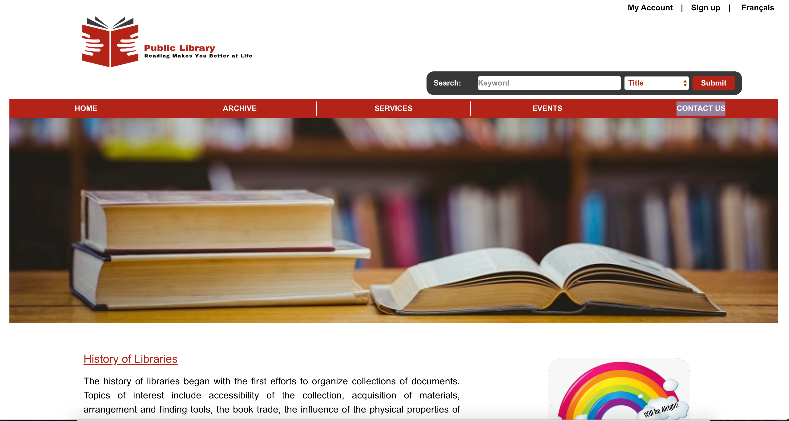
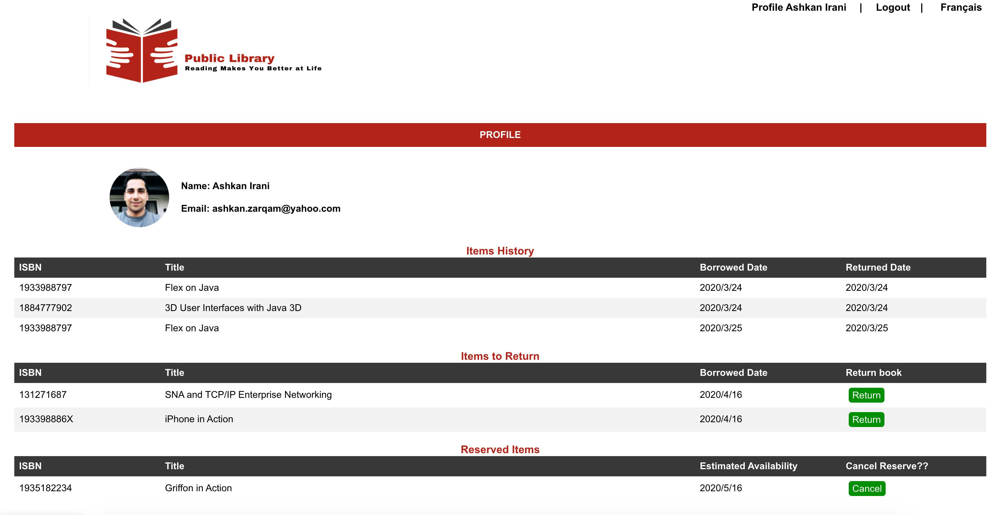

<h1> Public Library </h1>
<h2> Concordia Full-Stack Web Development Bootcamp - Final Project</h2>
<h3>Features: </h3>

 <ul>    
   <li> Mobile and desktop responsive available in two languages (French and English).
   <li> Search for references and filter them on categories, author(s), title and any keyword within item's description.</li>
   <li> Book or reserve the referneces also cancel any resevations. </li>
   <li> Login / Sign up with Google or Facebook account or any other Email address.</li>
   <li> Keep track of the users and references histories.</li> 
   <li> Providing an estimated date for references to be available for all members within it's reservation list.</li>
   <li> Google maps to find the library's location.</li>
   <li> Browse the references in gallery mode and providing item details page for every item.</li>  
 </ul>
   
<h3>Highlights: </h3>
 <ul>  
   <li> JavaScript</li>
   <li> React</li>
   <li> Hooks</li>
   <li> Redux / Redux Immer</li>
   <li> JavaScript Extension (JSX) </li>
   <li> NodeJS </li>
   <li> Express </li>
   <li> Google login, Google maps and Facebook login</li> 
   <li> MongoDB</li>
   <li> I18n</li>
 </ul>
   
<h3>Demo: </h3>
   
https://www.youtube.com/watch?v=2cNZauDhCRA&t=28s 

